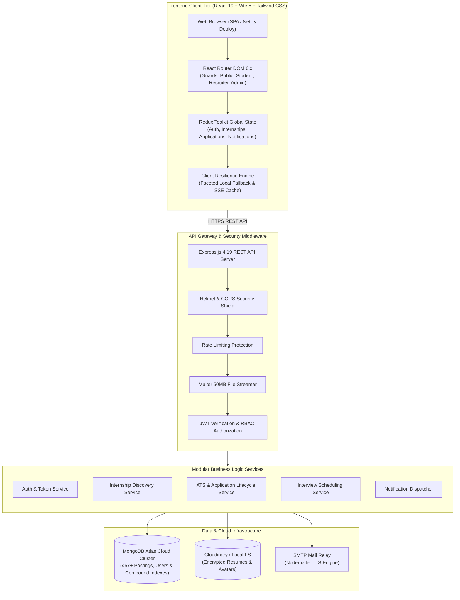

# InternHub — Modern Full-Stack Internship Discovery & Hiring Platform

<div align="center">


**A high-performance, enterprise-ready MERN platform connecting ambitious student talent, verified tech recruiters, and platform administrators.**

[](https://intern-mern.netlify.app/internships)
[](https://github.com/bunnyvalluri/MERN/actions)
[](https://nodejs.org)
[](https://react.dev)
[](https://vitejs.dev)
[](https://tailwindcss.com)
[](https://expressjs.com)
[](https://cloud.mongodb.com)
[](https://www.docker.com/)
[](LICENSE)

[🌐 Live Demo](https://intern-mern.netlify.app/internships) • [Key Highlights](#-key-highlights) • [System Architecture](#-system-architecture) • [Technology Stack](#-technology-stack) • [Repository Structure](#-repository-structure) • [Quick Start](#-quick-start) • [Database Layer](#-database-layer) • [Security & Observability](#-security--observability) • [Documentation](#-documentation)

</div>

---

## 📌 Executive Summary

**InternHub** is a production-grade, full-stack recruitment platform engineered to streamline the university-to-workplace hiring pipeline. Built on a clean, decoupled **MERN** monorepo architecture, the platform features dedicated top-level workspaces for:
- 💻 **`frontend/`** — React 19 Single Page Application with Tailwind CSS, Redux Toolkit, dynamic Avatar Studio, and atomic UI design system.
- ⚙️ **`backend/`** — Layered Express.js REST API with JWT auth, RBAC, 50MB file uploads, input sanitization, and structured Winston logging.
- 🗄️ **`database/`** — Automated MongoDB Atlas cloud seeders, index managers, diagnostics, schema data dictionaries, and reset utilities.
- 📚 **`docs/`** — Comprehensive engineering specifications, architecture guides, security audits, and API documentation.

---

## ✨ Key Highlights

### 🎓 Student Experience & Discovery
- **Live 24/7 Verified Opportunity Stream:** Instant discovery across 460+ verified tech roles from OpenAI, Google DeepMind, Anthropic, NVIDIA, Stripe, Databricks, Supabase, and more.
- **Weighted Full-Text Search:** High-performance search indexed on role titles (`weight: 10`), required skills (`weight: 5`), and company descriptions (`weight: 1`).
- **Multi-Facet Real-Time Filters:** Instant faceted filtering by workplace type (`REMOTE`, `HYBRID`, `ONSITE`), category, duration, tech stacks, and verified stipend minimums ($10k+/mo).
- **Interactive Avatar & Profile Studio:** Real-time 50MB profile photo uploader, zero-latency image previews, initials fallback, and bidirectional MongoDB sync.
- **ATS Resume Parsing Engine:** Upload resumes up to 50MB with multi-format parsing (PDF, DOCX) and instant profile attribute pre-filling.
- **One-Click Application Pipeline:** Attach cloud-hosted PDF resumes and tailored cover letters with automated duplicate application prevention.
- **Visual Application Progression:** Seven discrete lifecycle states (`APPLIED` → `UNDER_REVIEW` → `SHORTLISTED` → `INTERVIEW` → `SELECTED` / `REJECTED` / `WITHDRAWN`).
- **Interactive Interview Calendar:** Monthly agenda grid with video call link integration (Google Meet / Zoom).

### 🏢 Recruiter Management & ATS Pipeline
- **Company Branding Studio:** Customize corporate brand identity, verified domains, headquarters, and team size.
- **Granular Internship Lifecycle:** Draft, publish, edit, close, and archive opportunity listings with automated deadline tracking.
- **Candidate Review Hub:** Multi-tab candidate inspection, one-click PDF resume preview, internal recruiter rating notes, and status transitions.
- **Automated Interview Dispatcher:** Schedule video, phone, or technical coding rounds with automated candidate notifications.
- **Hiring Telemetry & Analytics:** Live visual conversion charts powered by Recharts (weekly application velocity, status distribution).

### 🛡️ Administrative Moderation & Governance
- **Platform Health Dashboard:** Real-time counters for active student talent, verified companies, live postings, and system throughput.
- **Company Verification Queue:** Fraud prevention workflow for vetting and assigning verified organization badges.
- **Forensic Security Audit Logs:** Structured tamper-resistant audit logs tracking actor ID, action type, IP address, and delta changes.
- **Emergency Broadcast System:** Real-time multi-channel broadcast messaging delivered to selected user roles.

---

## 🏛️ System Architecture



---

## 📂 Repository Structure

```
internship/
├── .github/                       # CI/CD Automation
│   └── workflows/
│       └── ci.yml                 # Automated security audit, lint, test & build pipeline
├── backend/                       # Node.js + Express REST API Server
│   ├── scripts/                   # Production verification scripts
│   ├── src/                       # Layered Application Architecture
│   │   ├── config/                # Database, Cloudinary, Logger configurations
│   │   ├── controllers/           # HTTP Request Handlers
│   │   ├── middleware/            # Auth, RBAC, Validation, 50MB Upload, Rate Limiting
│   │   ├── models/                # 10 Mongoose models with compound & text indexes
│   │   ├── routes/                # Express API Route definitions
│   │   ├── services/              # Domain business logic layer
│   │   ├── utils/                 # ApiError, token utils, Winston logger
│   │   ├── validators/            # Joi validation schemas
│   │   └── app.js                 # Express application setup
│   ├── tests/                     # Jest unit & integration test suites
│   ├── .env.example               # Backend environment template
│   ├── Dockerfile                 # Backend container definition
│   ├── package.json               # Backend dependencies & scripts
│   └── server.js                  # HTTP server entry point with graceful shutdown
├── frontend/                      # React 19 + Vite 5 SPA
│   ├── public/                    # Static assets, icons, robots.txt, sitemap.xml
│   ├── src/                       # Frontend application source
│   │   ├── assets/                # Visual graphics & SVG icons
│   │   ├── components/            # Reusable UI & Common components (Avatar, Switch, Badge)
│   │   ├── features/              # Modular domain features (auth, student, recruiter, internships)
│   │   ├── hooks/                 # Custom React hooks (useSEO, useAuth, useSSEStream)
│   │   ├── lib/                   # Axios client & interceptors
│   │   ├── pages/                 # Route-level pages & showcase
│   │   ├── routes/                # AppRouter & ProtectedRoute guards
│   │   ├── services/              # API Client services (upload, internship, auth)
│   │   ├── store/                 # Redux Toolkit store & slices
│   │   ├── utils/                 # Formatting & toast helpers
│   │   ├── App.jsx                # Root Application component
│   │   ├── index.css              # Tailwind CSS directives
│   │   └── main.jsx               # Vite React DOM entry point
│   ├── .env.example               # Frontend environment template
│   ├── Dockerfile                 # Frontend container definition
│   ├── package.json               # Frontend dependencies & scripts
│   ├── tailwind.config.js         # Design system tokens & animations
│   ├── vite.config.js             # Vite build & proxy settings
│   └── README.md                  # Detailed Frontend guide
├── database/                      # Dedicated Database Management System
│   ├── indexes/                   # MongoDB Index creation & verification
│   │   └── ensure_indexes.js      # Synchronizes compound & text indexes
│   ├── scripts/                   # Database maintenance & diagnostic utilities
│   │   ├── db_status.js           # Collection counts, health & connection latency check
│   │   └── reset_db.js            # Safe development DB wipe & re-seeding
│   └── README.md                  # Database documentation & CLI commands
├── docs/                          # Comprehensive Engineering Documentation (18 guides)
├── docker-compose.yml             # Local Multi-Container Docker Orchestration
├── netlify.toml                   # Netlify Single-Page Application deployment configuration
├── package.json                   # Root monorepo orchestration scripts
└── README.md                      # Master repository documentation
```

---

## 🚀 Quick Start

### 1. Clone & Install All Dependencies
```bash
git clone https://github.com/bunnyvalluri/MERN.git
cd MERN

# Installs dependencies for root, backend, and frontend
npm run install:all
```

---

### 2. Configure Environment Files
```bash
# Copy templates
cp backend/.env.example backend/.env
cp frontend/.env.example frontend/.env
```

Configure your **MongoDB Atlas Cloud URI** in `backend/.env`:
```env
MONGODB_URI=mongodb+srv://<username>:<password>@cluster0.uzbawnu.mongodb.net/internhub?retryWrites=true&w=majority&appName=Cluster0
```

---

### 3. Seed Database & Synchronize Indexes
```bash
# Seed realistic demo data (Users, Companies, Jobs, Applications, Interviews)
npm run db:seed

# Verify database health & collections
npm run db:status
```

---

### 4. Run Development Servers
```bash
# Concurrently starts Backend (port 5000) and Frontend (port 5173)
npm run dev
```

The application is now accessible at:
- 🌐 **Frontend SPA:** [http://localhost:5173](http://localhost:5173) (or live on [Netlify](https://intern-mern.netlify.app/internships))
- ⚙️ **Backend API:** [http://localhost:5000/api/v1](http://localhost:5000/api/v1)
- 🩺 **API Health Check:** [http://localhost:5000/api/v1/health](http://localhost:5000/api/v1/health)

---

## 🔑 Demo Seed Accounts & Credentials

| Role | Email | Password | Access / Capabilities |
|:-----|:------|:---------|:----------------------|
| **Admin** | `admin@internhub.dev` | `AdminPassword123!` | System statistics, user moderation, company verification |
| **Recruiter** (Stripe) | `sarah.jenkins@stripe.com` | `RecruiterPassword123!` | Stripe corporate branding, internship management, ATS |
| **Recruiter** (Google) | `mchen@google.com` | `RecruiterPassword123!` | Google internships, candidate reviews & scheduling |
| **Recruiter** (Microsoft) | `elena.rostova@microsoft.com` | `RecruiterPassword123!` | Microsoft postings & interview dispatch |
| **Recruiter** (OpenAI) | `mira@openai.com` | `RecruiterPassword123!` | AI research internships & applicant pipeline |
| **Recruiter** (NVIDIA) | `dhayes@nvidia.com` | `RecruiterPassword123!` | GPU Systems & CUDA engineering candidate review |
| **Student** (Stanford) | `jordan.lee@stanford.edu` | `StudentPassword123!` | Full profile (SWE), applied applications, bookmarks |

---

## 🛠️ Monorepo Root CLI Commands

| Command | Action |
|:--------|:-------|
| `npm run dev` | Runs backend and frontend concurrently with prefixed colored logs |
| `npm run dev:frontend` | Starts Vite frontend dev server on port 5173 |
| `npm run dev:backend` | Starts Express backend with nodemon on port 5000 |
| `npm run build` | Compiles the frontend application for production |
| `npm run test` | Runs all backend and frontend test suites |
| `npm run test:backend` | Executes backend unit & integration tests |
| `npm run test:frontend` | Executes frontend Vitest component tests |
| `npm run lint` | Runs ESLint across backend and frontend workspaces |
| `npm run format` | Formats all source files using Prettier |
| `npm run db:seed` | Populates MongoDB Atlas with realistic initial demo datasets |
| `npm run db:status` | Inspects database connection, latency, document counts, and indexes |
| `npm run db:indexes` | Synchronizes all compound, unique, and text search indexes |
| `npm run db:reset` | Drops development collections, rebuilds indexes, and re-seeds |
| `npm run install:all` | Installs dependencies across root, backend, and frontend |

---

## 🐳 Docker Multi-Container Orchestration

To run the entire stack (MongoDB + Express Backend + Vite Frontend) in Docker:

```bash
# Build and start all services in detached mode
docker-compose up -d --build

# View container logs
docker-compose logs -f

# Stop containers
docker-compose down
```

---

## 📚 Engineering Documentation

Comprehensive architecture, security, testing, and deployment documentation is organized in [**`docs/`**](./docs):

- 📐 [**Architecture Overview**](./docs/ARCHITECTURE.md) — System flow, data flow diagrams & tier design
- 🔌 [**API Specifications**](./docs/API.md) — Complete REST endpoint documentation & payloads
- 🗄️ [**Database Design & ERD**](./docs/DATABASE_DESIGN.md) — Schema specifications & indexing strategy
- 🔒 [**Security & Threat Model**](./docs/SECURITY.md) — Authentication, RBAC, input sanitization & rate limits
- 🧪 [**Testing Strategy**](./docs/TESTING.md) — Unit, integration, E2E lifecycle testing matrices
- 🚀 [**Deployment & DevOps Runbook**](./docs/DEPLOYMENT.md) — Production deployment to Netlify, Render & AWS
- 🤖 [**CI/CD Pipeline Guide**](./docs/CICD.md) — GitHub Actions multi-stage build & test pipeline
- 📊 [**Observability & Logging**](./docs/OBSERVABILITY.md) — Winston structured telemetry & request tracing
- 🎨 [**Design System Guide**](./docs/DESIGN_SYSTEM.md) — Atomic component library & color tokens

---

<div align="center">

Crafted with modern full-stack engineering practices by **Valluri Rahul**.  
© 2026 InternHub Platform, Inc. All rights reserved.

</div>
