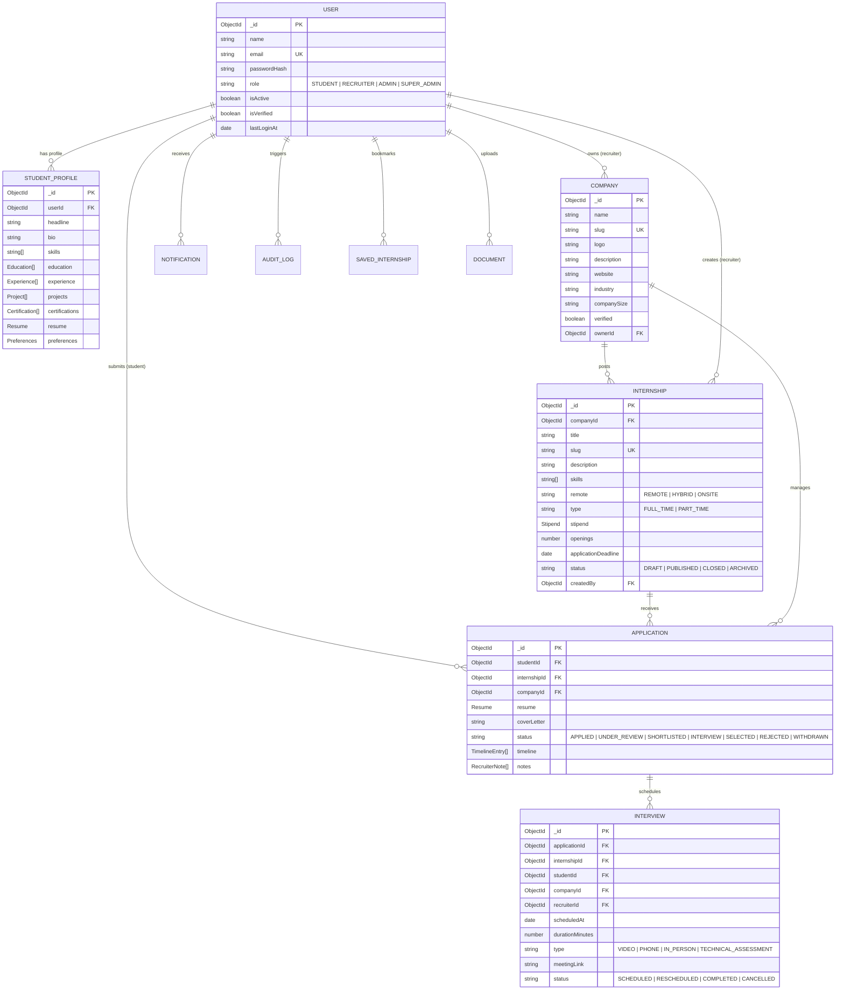

# InternHub — Database Schemas & Entity Relationship Reference

## Entity Relationship Overview (ERD)

---

## Collections & Index Catalog

| Collection | Key Primary Query Patterns | Configured Indexes |
|:-----------|:---------------------------|:-------------------|
| **`users`** | Auth login, email validation, role filters | `{ email: 1 }` (unique), `{ role: 1 }`, `{ isActive: 1, isVerified: 1 }` |
| **`studentProfiles`** | Skill matching, candidate search | `{ userId: 1 }` (unique), `{ skills: 1 }`, Text index on `{ headline, bio, skills }` |
| **`companies`** | Directory listing, recruiter verification | `{ slug: 1 }` (unique), `{ ownerId: 1 }`, `{ industry: 1, verified: 1 }`, Text search |
| **`internships`** | Search, filter by workplace/skills, deadline | `{ slug: 1 }` (unique), `{ companyId: 1, status: 1 }`, `{ status: 1, applicationDeadline: 1 }`, `{ status: 1, remote: 1, createdAt: -1 }`, Full-text index `{ title: 10, skills: 6, description: 1 }` |
| **`applications`** | Duplicate prevention, dashboard queries | `{ internshipId: 1, studentId: 1 }` (unique), `{ studentId: 1, status: 1, createdAt: -1 }`, `{ companyId: 1, status: 1, createdAt: -1 }` |
| **`interviews`** | Calendar timelines, candidate scheduling | `{ studentId: 1, scheduledAt: 1, status: 1 }`, `{ companyId: 1, scheduledAt: 1, status: 1 }`, `{ recruiterId: 1, scheduledAt: 1 }` |
| **`notifications`** | Unread badges, chronologic alert feeds | `{ userId: 1, read: 1, createdAt: -1 }`, `{ userId: 1, type: 1, createdAt: -1 }` |
| **`savedInternships`** | User bookmark library | `{ userId: 1, internshipId: 1 }` (unique) |
| **`auditLogs`** | Security audit trails & compliance | `{ actorId: 1, action: 1, createdAt: -1 }`, `{ targetModel: 1, targetId: 1 }` |
