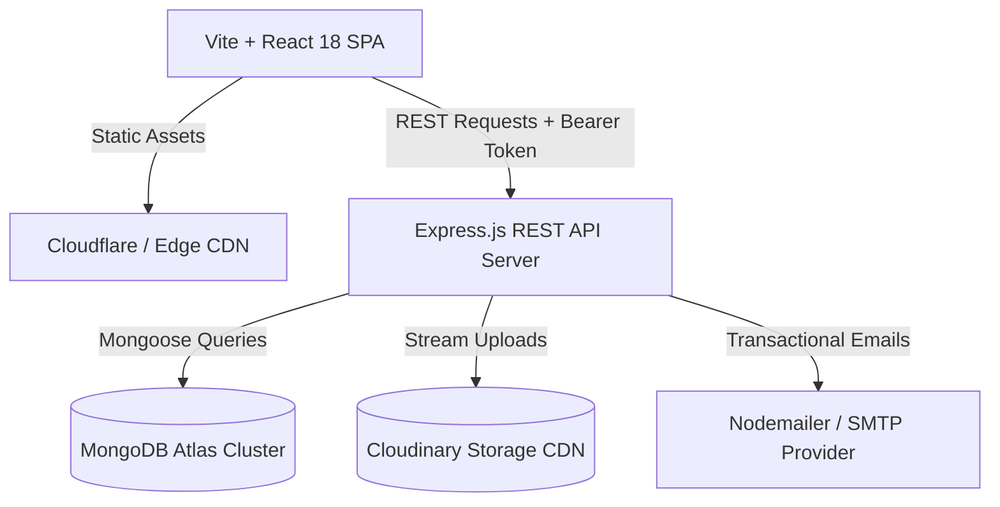
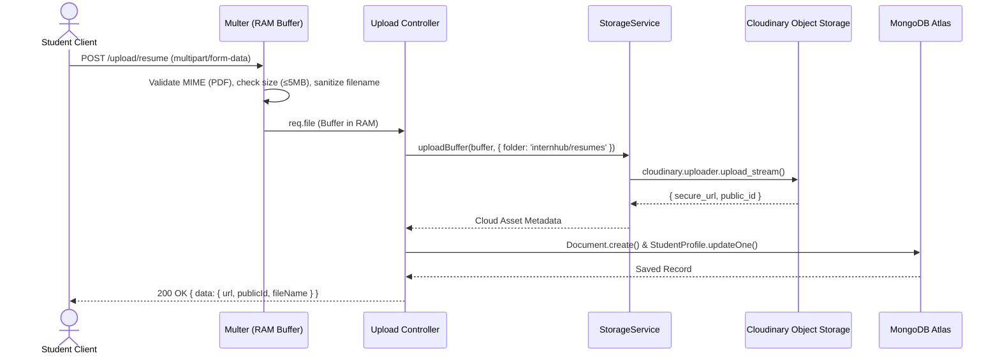

# InternHub — System Architecture Specification

> **Last updated:** 2026-08-24  
> **Target Audience:** Engineering, DevOps, Architecture Review

---

## Table of Contents

1. [High-Level System Architecture](#1-high-level-system-architecture)
2. [Component Layering](#2-component-layering)
3. [Frontend Architecture (Vite + React SPA)](#3-frontend-architecture-vite--react-spa)
4. [Backend Architecture (Node.js + Express)](#4-backend-architecture-nodejs--express)
5. [Authentication & Session Flow](#5-authentication--session-flow)
6. [Role-Based Access Control (RBAC) & IDOR Protection](#6-role-based-access-control-rbac--idor-protection)
7. [File Storage Pipeline](#7-file-storage-pipeline)
8. [Observability & Error Handling Pipeline](#8-observability--error-handling-pipeline)

---

## 1. High-Level System Architecture

InternHub follows a decoupled client-server architecture with cloud database and object storage backends:



---

## 2. Component Layering

```
┌────────────────────────────────────────────────────────────────────────┐
│                          PRESENTATION LAYER                            │
│  React 18 SPA • React Router DOM 6 • Redux Toolkit • Tailwind CSS     │
│  SEOHead (react-helmet-async) • ErrorBoundary • NetworkStatusBanner    │
└───────────────────────────────────┬────────────────────────────────────┘
                                    │ HTTPS / JSON / Cookies
┌───────────────────────────────────▼────────────────────────────────────┐
│                        API GATEWAY / MIDDLEWARE                        │
│  RequestId (UUID v4) • Helmet (Security) • CORS • JSON Body Parser     │
│  HttpLogger (JSON) • RateLimiter • Auth (JWT) • RBAC • Joi Validator   │
└───────────────────────────────────┬────────────────────────────────────┘
                                    │
┌───────────────────────────────────▼────────────────────────────────────┐
│                           CONTROLLER LAYER                             │
│  Auth • Internship • Application • Recruiter • Student • Admin • Health│
│  AsyncHandler • Standard ApiResponse (200/201) / ApiError (4xx/5xx)    │
└───────────────────────────────────┬────────────────────────────────────┘
                                    │
┌───────────────────────────────────▼────────────────────────────────────┐
│                            SERVICE LAYER                               │
│  AuthService • InternshipService • ApplicationService • AdminService   │
│  InterviewService • NotificationService • DocumentService • Storage   │
└───────────────────────────────────┬────────────────────────────────────┘
                                    │
┌───────────────────────────────────▼────────────────────────────────────┐
│                          DATA ACCESS LAYER                             │
│  Mongoose Models • Custom Compound Indexes • Aggregation Pipelines     │
│  MongoDB Atlas Replica Set                                            │
└────────────────────────────────────────────────────────────────────────┘
```

---

## 3. Frontend Architecture (Vite + React SPA)

### Feature-Driven Folder Structure
```
client/src/
├── app/                  # Central store configuration (store.js)
├── components/           # Reusable UI primitives (Button, Card, Modal, Badge)
│   └── common/           # Cross-cutting components (SEOHead, ErrorBoundary, NetworkBanner)
├── features/             # Domain feature modules
│   ├── auth/             # Login, Register, ForgotPassword, authSlice
│   ├── internships/      # Public discovery, search, filter, internshipSlice
│   ├── applications/     # Application submission, tracking, recruiter review
│   ├── recruiter/        # Recruiter portal, company profile, analytics
│   ├── student/          # Student profile, resume management, preferences
│   ├── interviews/       # Calendar scheduling, meeting links, interviewSlice
│   ├── notifications/    # In-app notifications dropdown, notificationSlice
│   └── admin/            # Admin moderation portal, metrics, user management
├── hooks/                # Custom React hooks (useSEO, useAuth)
├── lib/                  # Library configurations (axios.js with silent refresh)
├── routes/               # AppRouter with lazy-loaded route splitting & guards
├── services/             # API transport services
├── store/                # Global slices (networkSlice)
└── utils/                # apiError parsing, toast helpers, formatters
```

### State Management (Redux Toolkit)
The application state is partitioned into isolated feature slices:
- `auth`: Logged-in user context, access token, authentication state
- `student`: Profile details, resume metadata, career preferences
- `internships`: Public discovery catalog, active filters, search pagination
- `applications`: Student applications, recruiter review queues, application details
- `recruiter`: Company listings, candidate pipeline, hiring analytics
- `interviews`: Scheduled interviews, meeting URLs, calendar state
- `notifications`: Unread badge counters, recent notifications list
- `admin`: Platform metrics, user tables, audit logs
- `network`: Real-time online/offline connectivity state

---

## 4. Backend Architecture (Node.js + Express)

### Request Lifecycle Pipeline
Every inbound HTTP request travels through an ordered pipeline:

```
1. Request ID Generation (requestIdMiddleware)
2. Security Headers (helmet)
3. CORS Policy Validation (cors with allowedOrigins whitelist)
4. Rate Limiting (express-rate-limit)
5. Body Parsing (express.json, express.urlencoded, cookieParser)
6. Structured Request Logging (httpLoggerMiddleware)
7. Route Routing (/api/v1/*)
8. Authentication & RBAC Guard (authenticateUser, requireRole)
9. Request Schema Validation (validate(joiSchema))
10. Controller Execution (asyncHandler wrapping business service)
11. Response Dispatch (ApiResponse)
12. Global Centralized Error Handling (errorHandler with DB error mapping)
```

---

## 5. Authentication & Session Flow

InternHub uses a **dual-token architecture**:
- **Access Token:** Short-lived JWT (15 minutes), transmitted via `Authorization: Bearer <token>` in request memory.
- **Refresh Token:** Long-lived JWT (7 days), stored in an `HttpOnly`, `SameSite=Strict`, `Secure` cookie and persisted in MongoDB.

```mermaid
sequenceDiagram
  autonumber
  actor User as Browser / Client
  participant API as Express API
  participant DB as MongoDB Atlas

  User->>API: POST /api/v1/auth/login { email, password }
  API->>DB: User.findOne({ email }).select('+passwordHash')
  DB-->>API: User Record
  API->>API: bcrypt.compare(password, passwordHash)
  API->>DB: User.updateOne({ _id }, { refreshToken, lastLoginAt })
  API-->>User: Set-Cookie: refreshToken (HttpOnly); Body: { accessToken, user }

  Note over User,API: Normal API Requests with Bearer Access Token
  User->>API: GET /api/v1/applications/me [Authorization: Bearer <token>]
  API-->>User: 200 OK { data: [...] }

  Note over User,API: Access Token Expires (15 min)
  User->>API: GET /api/v1/applications/me [Expired Token]
  API-->>User: 401 Unauthorized (TOKEN_EXPIRED)
  User->>API: POST /api/v1/auth/refresh (Cookie: refreshToken)
  API->>DB: User.findOne({ refreshToken })
  DB-->>API: User Record
  API-->>User: 200 OK { accessToken: "new_jwt_..." }
  User->>API: Re-executes original failed request with new access token
  API-->>User: 200 OK { data: [...] }
```

---

## 6. Role-Based Access Control (RBAC) & IDOR Protection

### Role Hierarchy
```
SUPER_ADMIN (Full platform control)
  └── ADMIN (Platform moderation, company verification, user moderation)
        ├── RECRUITER (Post internships, manage applicants, schedule interviews)
        └── STUDENT (Apply to internships, manage profile & resume, track status)
```

### Insecure Direct Object Reference (IDOR) Mitigation
In addition to role-level checks, every resource-modifying controller verifies ownership before executing mutations:
- **Internships:** Verified that `internship.companyId.ownerId === req.user._id`
- **Applications:** Verified that `application.studentId === req.user._id` (for students) or `application.companyId.ownerId === req.user._id` (for recruiters)
- **Documents:** Verified that `document.userId === req.user._id`

---

## 7. File Storage Pipeline

File uploads (resumes, avatars, logos) are handled via in-memory streaming:



---

## 8. Observability & Error Handling Pipeline

1. **Request Tracking:** `X-Request-Id` UUID assigned at entry, attached to `req.requestId`, and returned on response headers.
2. **Structured Logging:** Winston emits structured JSON in production with `event`, `requestId`, `userId`, `responseTimeMs`, and `statusCode`.
3. **Sensitive Scrubbing:** All logged payloads pass through `sanitize()`, redacting passwords, tokens, API keys, and cookie headers.
4. **Centralized Error Classification:** Mongoose duplicate keys (11000) become 409, CastErrors become 400, and MongoNetworkErrors become 503. Stack traces are never exposed in production.
5. **Frontend Error Resilience:** React `GlobalErrorBoundary` catches rendering crashes and renders `ErrorFallback`. `NetworkStatusBanner` informs users of connection loss.
