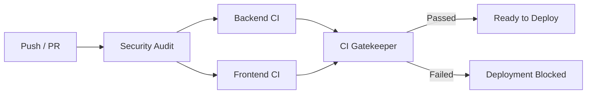

# InternHub — Continuous Integration & Continuous Deployment (CI/CD)

> **Last updated:** 2026-08-24  
> **Workflow File:** [`.github/workflows/ci.yml`](file:///c:/internship/.github/workflows/ci.yml)

---

## 1. Pipeline Overview

InternHub enforces a production-grade automated CI/CD pipeline configured via **GitHub Actions**. Every code change pushed to primary branches or submitted as a Pull Request must pass through strict quality, security, and build validation gates before merge or deployment.



---

## 2. Trigger Events & Concurrency

### Triggers
- **Push Events:** Triggers on pushes to `main`, `master`, and `release/**` branches.
- **Pull Request Events:** Triggers on all PRs targeting `main` and `master`.

### Concurrency Controls
```yaml
concurrency:
  group: ${{ github.workflow }}-${{ github.ref }}
  cancel-in-progress: true
```
Reduces compute waste by automatically terminating in-flight CI runs when newer commits are pushed to the same branch or PR.

---

## 3. Pipeline Stages & Jobs

### Job 1: Security & Vulnerability Audit (`security-audit`)
1. **Dependency Vulnerability Scanning:** Runs `npm audit --audit-level=high` across root, `server/`, and `client/` workspaces.
2. **Secret Leak Prevention:** Scans git tracked files to ensure no real `.env` files, production credentials, or unencrypted private keys are committed into version control.

### Job 2: Backend CI (`backend-ci`)
1. **Environment Template Validation:** Confirms `server/.env.example` exists and is formatted correctly.
2. **Dependency Installation with Caching:** Uses `actions/setup-node` caching keyed on `server/package-lock.json` for deterministic, fast `npm ci` installs.
3. **Static Analysis & Linting:** Runs ESLint (`npm run lint`) enforcing ES2022 standards, unused variable detection, and asynchronous safety (`require-await`, `no-return-await`).
4. **Application Bootstrapping Validation:** Evaluates `server/src/app.js` using Node.js `--eval` to verify all dynamic module imports, middleware chains, and routes resolve without syntax or runtime exceptions.
5. **Automated Unit Testing:** Executes Jest unit tests (`npm run test:unit`) across authorization models, RBAC helpers, token utilities, and operational error factories.

### Job 3: Frontend CI (`frontend-ci`)
1. **Environment Template Validation:** Confirms `client/.env.example` exists and documents required client-side environment keys.
2. **Dependency Installation with Caching:** Uses cached package dependencies keyed on `client/package-lock.json`.
3. **Static Code Analysis:** Runs ESLint across all `.js` and `.jsx` component and page trees.
4. **Unit & Component Testing:** Runs Vitest test suites (`npm run test`) validating client error parsers, Redux slices (`networkSlice`), and metadata helpers (`useSEO`).
5. **Production Bundle Compilation:** Runs `npm run build` (Vite 5) to compile optimized minified JavaScript chunks and CSS bundles.
6. **Artifact Integrity Verification:** Asserts that output artifacts `dist/index.html`, `dist/robots.txt`, and `dist/sitemap.xml` are present.

### Job 4: CI Gatekeeper (`ci-status`)
Evaluates the execution status of all parallel jobs. If any lint check, unit test, or build step fails, the workflow exits with a non-zero exit code, automatically blocking the pull request merge and preventing continuous deployment hooks from triggering.

---

## 4. Secret & Environment Variable Management

> [!IMPORTANT]
> **Zero Secrets in Workflow Files:** No production credentials, MongoDB Atlas connection strings, Cloudinary secrets, or SMTP passwords are ever hardcoded in `.github/workflows/ci.yml`.

### CI Environment Fallbacks
The CI test runner supplies safe dummy secrets in the workflow definition strictly for running local Jest unit tests (e.g. testing JWT signature creation without external infrastructure):

```yaml
env:
  NODE_ENV: test
  JWT_ACCESS_SECRET: ci_test_jwt_access_secret_key_minimum_64_characters_long_for_security
  JWT_REFRESH_SECRET: ci_test_jwt_refresh_secret_key_minimum_64_characters_long_for_security
```

### Production Secrets Configuration
In deployment environments (Vercel / Render / Railway), configure production secrets exclusively through the platform environment manager or GitHub Repository Secrets:

| Secret Name | Purpose |
|---|---|
| `MONGODB_URI` | MongoDB Atlas production connection string |
| `JWT_ACCESS_SECRET` | 64+ byte secret for access token signing |
| `JWT_REFRESH_SECRET` | 64+ byte secret for refresh token signing |
| `CLOUDINARY_CLOUD_NAME` | Cloudinary tenant identifier |
| `CLOUDINARY_API_KEY` | Cloudinary REST API key |
| `CLOUDINARY_API_SECRET` | Cloudinary API secret |
| `SMTP_USER` | Email dispatch service account |
| `SMTP_PASS` | App password for transactional email delivery |

---

## 5. Local CI Emulation

To verify that your branch will pass all CI checks before pushing to GitHub, run the local verification suite:

```bash
# 1. Run ESLint on both workspaces
npm run lint

# 2. Run unit tests on server and client
npm run test

# 3. Test frontend production build
npm run build --prefix client

# 4. Validate backend syntax
node --input-type=module --eval "import './server/src/app.js'; console.log('Backend OK');"
```
