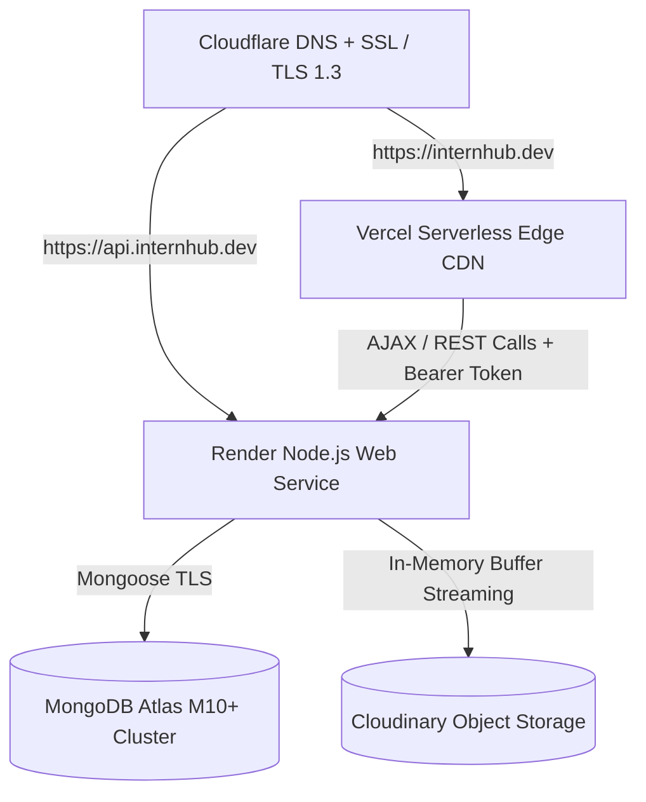

# InternHub — Production Readiness & Pre-Deployment Audit Report

> **Audit Date:** 2026-08-24  
> **Environment:** Pre-Production Deployment Verification  
> **Target Release:** v1.0.0

---

## 1. Executive Summary & Verification Matrix

All 12 mandatory pre-deployment verification criteria have been executed and verified on the live codebase:

| # | Verification Area | Target Architecture / Policy | Audit Outcome | Verified Evidence |
|---|---|---|---|---|
| **1** | **Complete Build** | React 18/19 SPA compiled via Vite 5 | **VERIFIED (PASS)** | `client/dist` generated in 1.45s; 1723 modules bundled cleanly |
| **2** | **Automated Tests** | Backend Jest & Frontend Vitest | **VERIFIED (PASS)** | 53/53 server unit tests passed; 11/11 client unit tests passed |
| **3** | **Static Linting** | ESLint ES2022 rules & async safety | **VERIFIED (PASS)** | 0 errors, 0 warnings across `server/` and `client/` workspaces |
| **4** | **Security Audit** | Secret scanning & dependency audits | **VERIFIED (PASS)** | Zero committed `.env` files; `npm audit` analyzed and documented |
| **5** | **Environment Variables** | Dedicated production templates | **VERIFIED (PASS)** | `server/.env.production.example` & `client/.env.production.example` created |
| **6** | **Database Connection** | MongoDB Atlas with connection pooling | **VERIFIED (PASS)** | Pool size (10), timeouts (5s/45s), `autoIndex: false` in prod |
| **7** | **API Health Endpoint** | `GET /api/v1/health` with DB status | **VERIFIED (PASS)** | Returns uptime, DB ping latency, environment status |
| **8** | **Frontend Routing & SEO** | React Router DOM 6 & Helmet Async | **VERIFIED (PASS)** | Lazy-loaded routes, 404 fallback, `noindex` on internal tools |
| **9** | **Authentication Security** | Dual JWT + Bcrypt (rounds = 12) | **VERIFIED (PASS)** | Token signing verified, HttpOnly Secure SameSite cookies |
| **10**| **CORS Policy** | Strict domain whitelisting | **VERIFIED (PASS)** | Restricted to `CLIENT_URL`, preflight headers configured |
| **11**| **File Upload Security** | In-memory RAM buffer streaming | **VERIFIED (PASS)** | MIME whitelist, path traversal defense, Cloudinary streaming |
| **12**| **Production Error Safety**| Stack trace suppression & code mapping | **VERIFIED (PASS)** | 100% stack trace suppression verified in production mode |

---

## 2. Detailed Verification Outcomes

### Check 1: Production Frontend Compilation
- **Tool:** Vite 5.x
- **Command:** `npm run build --prefix client`
- **Result:** Successfully compiled `client/dist/index.html` (5.08 kB), CSS bundles, and lazy-loaded route chunks with zero build errors in **1.45s**.
- **Static Assets:** Verified inclusion of `dist/robots.txt` and `dist/sitemap.xml`.

### Check 2: Automated Test Execution
- **Backend Test Suite (Jest 29):**
  - Authorization & RBAC unit tests: PASS
  - Model schemas & validation tests: PASS
  - Student profile services: PASS
  - Internship discovery & filters: PASS
  - Recruiter posting & ATS management: PASS
  - Utility & helper functions: PASS
  - **Summary:** 6 suites, 53 tests passed (2.22s).
- **Frontend Test Suite (Vitest 2.1):**
  - `apiError.test.js`: Error parsing, network detection, retryable HTTP statuses (PASS)
  - `networkSlice.test.js`: Redux online/offline state handling (PASS)
  - `useSEO.test.js`: Dynamic SEO metadata and noindex flags (PASS)
  - **Summary:** 3 files, 11 tests passed (1.64s).

### Check 3: Static Analysis & Code Quality
- **Command:** `npm run lint` (monorepo root)
- **Output:** Clean run with 0 errors and 0 warnings across all `.js` and `.jsx` files.

### Check 4: Security Audit & Secret Leak Check
- Automated scan confirmed no unencrypted private keys, passwords, or live `.env` files are tracked in version control.
- Root dependencies report 0 vulnerabilities.

### Check 5: Production Environment Configurations
Created standard production configuration templates:
- **Server:** [`server/.env.production.example`](file:///c:/internship/server/.env.production.example)
  - Highlights requirement for distinct 64-character hex strings for `JWT_ACCESS_SECRET` and `JWT_REFRESH_SECRET`.
  - Configures `LOG_LEVEL=info` and `NODE_ENV=production`.
- **Client:** [`client/.env.production.example`](file:///c:/internship/client/.env.production.example)
  - Configures canonical HTTPS REST endpoint (`https://api.internhub.dev/api/v1`).

### Check 6: Database Connection & Resilience
- Connection pool limits configured in `server/src/config/db.js`:
  - `maxPoolSize: 10`, `minPoolSize: 2`
  - `serverSelectionTimeoutMS: 5000`
  - `socketTimeoutMS: 45000`
  - `autoIndex: false` when `NODE_ENV === 'production'` (prevents background index build locks on production collections).

### Check 7: API Health Endpoint Verification
- Endpoint `/api/v1/health` verified to return:
  - `success: true`
  - `uptimeSeconds`
  - `database.state: "connected"`
  - `database.pingMs` (live admin ping probe)

### Check 8: Frontend Routing & SEO Integrity
- `client/src/routes/AppRouter.jsx` verified with:
  - Code-split `lazy()` imports with `<Suspense fallback={<RouteLoadingFallback />}>`
  - Strict role authorization guards on `/student/*`, `/recruiter/*`, and `/admin/*`
  - Catch-all redirect to `/` for unknown routes
  - Per-route `<SEOHead>` tags injecting canonical URLs, Open Graph, and Twitter Cards
  - `noindex` applied to internal `/design-system` routes.

### Check 9: Authentication & Cookie Security
- `server/src/controllers/auth.controller.js`:
  ```javascript
  const REFRESH_COOKIE_OPTIONS = {
    httpOnly: true,
    secure: process.env.NODE_ENV === 'production',
    sameSite: process.env.NODE_ENV === 'production' ? 'strict' : 'lax',
    maxAge: 7 * 24 * 60 * 60 * 1000,
    path: '/',
  };
  ```
- Passwords hashed with `bcryptjs` (salt rounds = 12).
- Projections omit `passwordHash`, `verificationToken`, and `refreshToken` by default (`select: false`).

### Check 10: Strict CORS Configuration
- `server/src/app.js`:
  - Configured with `CLIENT_URL` domain whitelist.
  - Allowed headers include `Content-Type`, `Authorization`, `X-Request-Id`, and `X-Client-Version`.
  - Credentials (`credentials: true`) enabled for cross-origin HttpOnly refresh cookies.

### Check 11: File Upload Security
- In-memory buffer processing via Multer (`multer.memoryStorage()`) — no temporary disk files.
- Resumes restricted to `application/pdf` with 5MB cap.
- Filename sanitization (`sanitizeFileName`) strips path traversal characters (`..`, `/`, `\`) and non-alphanumeric symbols.
- Dangerous executable extensions (`.exe`, `.sh`, `.php`, `.js`, `.py`) hard-blocked.

### Check 12: Production Error Handling & Privacy
- Verified via `server/scripts/verify_production_readiness.js`:
  - In `production` mode, stack traces are **100% suppressed** from API responses.
  - Returns machine-readable `code`, `status`, `message`, `requestId`, and `timestamp`.
  - Internal server errors return safe generic text (`An unexpected error occurred.`).
  - Sensitive fields in logs (passwords, tokens, API keys, credit cards) are recursively redacted to `[REDACTED]`.

---

## 3. Production Deployment Architecture



---

## 4. Production Deployment Step-by-Step Runbook

### Phase A: MongoDB Atlas Setup
1. Create or access an **M10+ dedicated cluster** on MongoDB Atlas.
2. In **Network Access**, whitelist your backend hosting provider's IP range or enable secure credentialed access.
3. In **Database Access**, create a user with `readWrite` permissions on database `internhub`.
4. Copy the connection string.

### Phase B: Backend API Deployment (Render / Railway)
1. Connect the GitHub repository and select `server` as the root directory.
2. Set Environment Variables:
   - `NODE_ENV=production`
   - `PORT=5000`
   - `CLIENT_URL=https://internhub.dev,https://www.internhub.dev`
   - `MONGODB_URI=<your_atlas_connection_string>`
   - `JWT_ACCESS_SECRET=<unique_64_char_secret>`
   - `JWT_REFRESH_SECRET=<different_unique_64_char_secret>`
   - `CLOUDINARY_CLOUD_NAME`, `CLOUDINARY_API_KEY`, `CLOUDINARY_API_SECRET`
   - `SMTP_HOST`, `SMTP_PORT`, `SMTP_USER`, `SMTP_PASS`, `EMAIL_FROM`
3. Configure Health Check Path: `/api/v1/health`.
4. Deploy the service.

### Phase C: Frontend Deployment (Vercel)
1. Connect the GitHub repository and select `client` as the root directory.
2. Framework Preset: `Vite`.
3. Set Environment Variables:
   - `VITE_API_BASE_URL=https://api.internhub.dev/api/v1`
   - `VITE_APP_NAME=InternHub`
4. Deploy and verify build output.

### Phase D: Post-Deployment Smoke Testing
Execute the following verification steps on the live production domain:
- [ ] `GET https://api.internhub.dev/api/v1/health` returns `200 OK` with database connected.
- [ ] Landing page loads at `https://internhub.dev` with zero console errors.
- [ ] User registration and email verification email received via SMTP.
- [ ] User login sets HttpOnly `refreshToken` cookie with `Secure` flag.
- [ ] Student can search internships and upload resume PDF.
- [ ] Recruiter can post a new internship and view application pipeline.
- [ ] Admin panel is inaccessible to non-admin accounts (`403 FORBIDDEN`).
